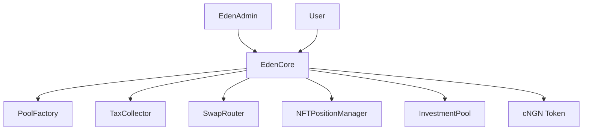

# EdenCore Contract

The **EdenCore** contract is the main entry point and orchestrator for the EdenVest protocol. It manages investments, pool creation, token swaps, and coordinates with all other protocol components.

<Note>
**Contract Address (Testnet):** `0x0188a48B4c19Ad164C70dc9EA73d9C275699679F`
</Note>

## Overview

EdenCore serves as the central hub that:
- **Processes all investments** and withdrawals
- **Manages pool registry** and activation status  
- **Coordinates token swaps** via integrated Uniswap router
- **Handles tax collection** and distribution
- **Enforces protocol-wide security** measures

## Key Features

### 🎯 **Investment Management**
- Direct cNGN investments with deadline protection
- Token swap integration for seamless UX
- Automatic LP token minting and tax collection
- Comprehensive slippage and liquidity checks

### 🏭 **Pool Management** 
- Pool creation via factory pattern
- Registry of all active/inactive pools
- Pool configuration validation
- Administrative controls for pool status

### 🔒 **Security & Governance**
- Upgradeable via UUPS proxy pattern
- Multi-role access control system
- Emergency pause functionality
- Integration with EdenAdmin for multisig operations

## Contract Architecture



## Core Functions

### Investment Functions

#### `invest()`
Direct investment using cNGN tokens.

```solidity
function invest(
    address pool,
    uint256 amount, 
    string memory title,
    uint256 deadline
) external returns (uint256 tokenId, uint256 lpTokens)
```

**Parameters:**
- `pool`: Target investment pool address
- `amount`: Investment amount in cNGN  
- `title`: Custom title for the investment
- `deadline`: Transaction deadline (0 for no deadline)

**Returns:**
- `tokenId`: NFT position token ID
- `lpTokens`: LP tokens minted to investor

<CodeGroup>
```solidity Example Usage
// Direct cNGN investment
uint256 amount = 1000 * 10**18; // 1000 cNGN
address pool = 0x123...; // Pool address
string memory title = "My Investment";
uint256 deadline = block.timestamp + 300; // 5 minutes

(uint256 tokenId, uint256 lpTokens) = edenCore.invest(
    pool,
    amount,
    title, 
    deadline
);
```

```javascript JavaScript SDK
const investment = await edenVest.invest({
  pool: '0x123...',
  amount: ethers.utils.parseEther('1000'),
  title: 'My Investment',
  deadline: Math.floor(Date.now() / 1000) + 300
});

console.log('NFT Token ID:', investment.tokenId);
console.log('LP Tokens:', investment.lpTokens);
```
</CodeGroup>

#### `investWithSwap()`
Investment with automatic token swapping.

```solidity
function investWithSwap(InvestmentParams memory params) 
    external returns (uint256 tokenId, uint256 lpTokens)
```

**InvestmentParams Structure:**
```solidity
struct InvestmentParams {
    address pool;           // Target pool
    address tokenIn;        // Input token to swap
    uint256 amountIn;       // Input token amount
    uint256 minAmountOut;   // Minimum cNGN output
    uint256 deadline;       // Transaction deadline
    string title;           // Investment title
}
```

<CodeGroup>
```solidity Advanced Swap Investment
InvestmentParams memory params = InvestmentParams({
    pool: poolAddress,
    tokenIn: 0x456..., // USDC address
    amountIn: 1000 * 10**6, // 1000 USDC
    minAmountOut: 950 * 10**18, // Min 950 cNGN (5% slippage)
    deadline: block.timestamp + 600,
    title: "USDC -> cNGN Investment"
});

(uint256 tokenId, uint256 lpTokens) = edenCore.investWithSwap(params);
```

```javascript JavaScript Integration
const swapInvestment = await edenVest.investWithSwap({
  pool: poolAddress,
  tokenIn: USDC_ADDRESS,
  amountIn: ethers.utils.parseUnits('1000', 6), // 1000 USDC
  minAmountOut: ethers.utils.parseEther('950'), // Min 950 cNGN
  deadline: Math.floor(Date.now() / 1000) + 600,
  title: 'USDC -> cNGN Investment'
});
```
</CodeGroup>

### Withdrawal Functions

#### `withdraw()`
Withdraw matured investments by burning LP tokens and NFT.

```solidity
function withdraw(
    address pool,
    uint256 tokenId, 
    uint256 lpTokenAmount
) external returns (uint256 withdrawAmount)
```

**Process:**
1. Validates investment maturity and ownership
2. Burns LP tokens and NFT position
3. Transfers principal + returns to investor

### Pool Management Functions

#### `createPool()`
Create new investment pools (Admin only).

```solidity  
function createPool(IPoolFactory.PoolParams memory poolParams)
    external onlyRole(POOL_CREATOR_ROLE) returns (address pool)
```

**PoolParams Structure:**
```solidity
struct PoolParams {
    string name;                // Pool name
    string symbol;              // LP token symbol  
    address admin;              // Pool administrator
    address poolMultisig;       // Pool multisig wallet
    address[] multisigSigners;  // Multisig signers
    address cNGN;              // cNGN token address
    uint256 lockDuration;      // Lock period in seconds
    uint256 minInvestment;     // Minimum investment amount
    uint256 maxInvestment;     // Maximum investment amount  
    uint256 utilizationCap;    // Total pool capacity
    uint256 expectedRate;      // Expected APY in basis points
    uint256 taxRate;           // Pool-specific tax rate
}
```

### View Functions

#### `getAllPools()` / `getActivePools()`
Retrieve pool information.

```solidity
function getAllPools() external view returns (address[] memory)
function getActivePools() external view returns (address[] memory)
```

#### `checkSwapLiquidity()`
Check available liquidity for token swaps.

```solidity
function checkSwapLiquidity(address tokenIn, uint256 amountIn) 
    external returns (uint256 expectedOut, bool hasLiquidity)
```

## Access Control

The contract implements OpenZeppelin's `AccessControl` with these roles:

| Role | Purpose | Functions |
|------|---------|-----------|
| `DEFAULT_ADMIN_ROLE` | Super admin | All admin functions |
| `ADMIN_ROLE` | Protocol admin | Configuration updates |  
| `POOL_CREATOR_ROLE` | Pool creator | Create pools |
| `EMERGENCY_ROLE` | Emergency controls | Pause/emergency functions |

## Events

### Investment Events
```solidity
event InvestmentMade(
    address indexed pool,
    address indexed investor, 
    uint256 tokenId,
    uint256 amount,
    uint256 lpTokens
);
```

### Administrative Events  
```solidity
event TaxRateUpdated(uint256 oldRate, uint256 newRate);
event TreasuryUpdated(address oldTreasury, address newTreasury);
event EmergencyWithdraw(
    address token,
    uint256 amount, 
    address treasury,
    string reason,
    address admin
);
```

## Error Handling

The contract includes comprehensive error checking:

```solidity
error InvalidPool();
error InvalidAmount(); 
error PoolNotActive();
error InvalidTaxRate();
error DeadlineExpired();
error SwapFailed();
error InsufficientLiquidity();
```

## Integration Examples

### React Frontend Integration

```javascript
import { ethers } from 'ethers';
import EdenCoreABI from './abis/EdenCore.json';

const EDEN_CORE_ADDRESS = '0x5c932dDfA2a0c1283ca73F51970f0C99c6Bdf214';

class EdenVestIntegration {
  constructor(provider) {
    this.contract = new ethers.Contract(
      EDEN_CORE_ADDRESS,
      EdenCoreABI,
      provider
    );
  }

  async getActivePools() {
    return await this.contract.getActivePools();
  }

  async invest(poolAddress, amount, title) {
    const tx = await this.contract.invest(
      poolAddress,
      amount,
      title,
      Math.floor(Date.now() / 1000) + 300 // 5 min deadline
    );
    return await tx.wait();
  }

  async checkSwapQuote(tokenIn, amountIn) {
    return await this.contract.checkSwapLiquidity(tokenIn, amountIn);
  }
}
```

### Pool Creation Example

```javascript
async function createNewPool() {
  const poolParams = {
    name: "High Yield 30-Day Pool",
    symbol: "HY30",
    admin: adminAddress,
    poolMultisig: multisigAddress,
    multisigSigners: [signer1, signer2, signer3],
    cNGN: cNGN_ADDRESS,
    lockDuration: 30 * 24 * 60 * 60, // 30 days
    minInvestment: ethers.utils.parseEther('100'), // 100 cNGN
    maxInvestment: ethers.utils.parseEther('10000'), // 10k cNGN
    utilizationCap: ethers.utils.parseEther('100000'), // 100k total
    expectedRate: 1500, // 15% APY
    taxRate: 250 // 2.5% tax
  };

  const tx = await edenCore.createPool(poolParams);
  const receipt = await tx.wait();
  
  // Extract pool address from events
  const event = receipt.events.find(e => e.event === 'PoolCreated');
  return event.args.pool;
}
```

## Security Considerations

### Input Validation
- All amounts must be greater than zero
- Pool addresses must be registered and active
- Deadlines must be in the future
- Token addresses must be valid contracts

### Slippage Protection  
- Automatic slippage calculation for swaps
- Configurable maximum slippage limits
- Real-time liquidity checks

### Access Controls
- Role-based function access
- Multisig requirements for critical operations
- Emergency pause capabilities

## Upgrade Mechanism

EdenCore uses the UUPS (Universal Upgradeable Proxy Standard) pattern:

- **Proxy Contract**: Handles storage and delegatecalls
- **Implementation Contract**: Contains business logic
- **Admin Controls**: Only `ADMIN_ROLE` can authorize upgrades

<Warning>
Upgrades must be carefully planned and tested to ensure storage layout compatibility and prevent data corruption.
</Warning>

## Next Steps

<CardGroup cols={2}>
  <Card
    title="Investment Pools"
    icon="swimming-pool"
    href="/contracts/investment-pool"
  >
    Learn about individual pool mechanics and configuration
  </Card>
  <Card
    title="NFT Positions"  
    icon="image"
    href="/contracts/nft-position-manager"
  >
    Understand how investment positions are tracked via NFTs
  </Card>
  <Card
    title="Tax Collection"
    icon="coins"
    href="/contracts/tax-collector"  
  >
    Explore the protocol fee collection and distribution system
  </Card>
  <Card
    title="Integration Guide"
    icon="code"
    href="/api/overview"
  >
    Build applications using the EdenVest protocol
  </Card>
</CardGroup>