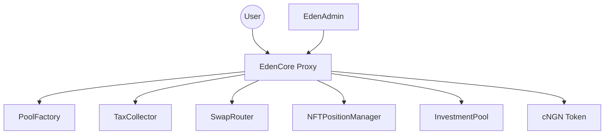

# EdenCore Contract

The **EdenCore** contract is the main orchestrator for the EdenVest protocol. It routes deposits, performs token swaps to **cNGN**, mints **LP tokens** and **NFT positions**, handles withdrawals (with optional swap on exit), and coordinates pool lifecycle via the factory.


<Note>
**Network:** Asset Chain Testnet  
**Proxy Address:** `0xB3DdDA0f6C116687B70CAcbffC339B1749D9A53B`  
**Implementation:** `0x1524E3b918465F3BEC2275a5C12D71Fff26C144e`
</Note>

## Related Contracts

| Component | Address |
|-----------|---------|
| **EdenAdmin** | `0xAe583ca16d7DaD1fDD04Af5C42F24AdF6Dd451C8` |
| **Pool Factory** | `0xD21DaF50D4A53C84673166F4449E42D467584034` |
| **Tax Collector** | `0x0b2598084C5B36939E8f3646949dBE91d856d708` |
| **Swap Router** | `0x50913d6dCb1eb3b669b036c52A4d3d4a8405C576` |
| **NFT Position Manager** | `0x867518e93f73A0260ff35B6E4FD85a2baED27174` |
| **NFT Renderer** | `0xCbaE3bc14b761589aba8EaB06B16e520c04500DA` |


## What EdenCore Does

<CardGroup cols={2}>
  <Card title="Process Investments" icon="coins">
    Accepts direct cNGN or performs swap-then-invest in one transaction
  </Card>
  <Card title="Mint Receipts" icon="receipt">
    Issues LP tokens (ERC‑20) and non-transferable NFT positions (ERC‑721)
  </Card>
  <Card title="Handle Withdrawals" icon="arrow-up-from-bracket">
    Redeem to cNGN or swap to chosen token on exit
  </Card>
  <Card title="Manage Pools" icon="swimming-pool">
    Create and toggle pool activation through the factory
  </Card>
</CardGroup>
## Key Features


### Architecture Flow



## Key Data Structures

### InvestmentParams

Used for swap-and-invest operations:

```solidity
struct InvestmentParams {
    address pool;         // Target investment pool
    address tokenIn;      // Input token (if swapping)
    uint256 amountIn;     // Amount of tokenIn
    uint256 minAmountOut; // Minimum cNGN expected after swap
    uint256 deadline;     // Expiry timestamp (unix)
    string title;         // Saved in NFT metadata
}
```

### WithdrawAndSwapParams

Used for withdraw-and-swap operations:

```solidity
struct WithdrawAndSwapParams {
    address pool;           // Pool address
    uint256 tokenId;        // NFT position ID
    uint256 lpTokenAmount;  // LP tokens to redeem
    address tokenOut;       // Desired output token
    uint256 minAmountOut;   // Minimum amount expected
    uint256 deadline;       // Transaction deadline
    uint256 maxSlippageBps; // Max slippage (default 100 = 1%)
}
```


## Core Functions

### Investment Functions

#### `invest()`
Direct investment using cNGN tokens without swapping.

```solidity
function invest(
    address pool,
    uint256 amount, 
    string memory title,
    uint256 deadline
) external returns (uint256 tokenId, uint256 lpTokens)
```

**Parameters:**
- `pool`: Target investment pool address
- `amount`: Investment amount in cNGN  
- `title`: Custom title for the investment
- `deadline`: Transaction deadline (0 for no deadline)

**Process Flow:**
1. Validates pool registration and active status
2. Transfers cNGN from user and approves pool
3. Calls `InvestmentPool.invest()` to mint LP and NFT
4. Collects protocol tax in LP tokens to TaxCollector
5. Emits `InvestmentMade` event

**Returns:**
- `tokenId`: NFT position token ID
- `lpTokens`: LP tokens minted to investor

<CodeGroup>
```javascript Frontend Integration
import { ethers } from "ethers";
import EdenCoreABI from "./abis/EdenCore.json";

const core = new ethers.Contract(
  "0xB3DdDA0f6C116687B70CAcbffC339B1749D9A53B",
  EdenCoreABI,
  signer
);

// 1. Approve cNGN to EdenCore
await cNGNContract.approve(
  core.address, 
  ethers.utils.parseEther("1000")
);

// 2. Make investment
const tx = await core.invest(
  POOL_ADDRESS,
  ethers.utils.parseEther("1000"),
  "My Investment",
  Math.floor(Date.now()/1000) + 300 // 5 min deadline
);

const receipt = await tx.wait();
console.log("Investment successful!", receipt);
```

```solidity Direct Contract Call
// Solidity example for contract integration
IERC20(cNGN).approve(edenCore, investmentAmount);

(uint256 tokenId, uint256 lpTokens) = IEdenCore(edenCore).invest(
    poolAddress,
    investmentAmount,
    "Smart Contract Investment",
    block.timestamp + 300
);
```
</CodeGroup>

#### `investWithSwap()`
Invest using any ERC‑20 token. EdenCore swaps to cNGN then invests in one transaction.

```solidity
function investWithSwap(InvestmentParams memory params) 
    external returns (uint256 tokenId, uint256 lpTokens)
```

**Advanced Features:**
- **Slippage Protection**: Applies default 1% slippage protection
- **Liquidity Validation**: Checks available swap liquidity
- **Balance Verification**: Ensures swap executed correctly


**InvestmentParams Structure:**
```solidity
struct InvestmentParams {
    address pool;           // Target pool
    address tokenIn;        // Input token to swap
    uint256 amountIn;       // Input token amount
    uint256 minAmountOut;   // Minimum cNGN output
    uint256 deadline;       // Transaction deadline
    string title;           // Investment title
}
```

<CodeGroup>
```javascript Swap Investment Example
// 1. Approve input token to EdenCore
await usdcContract.approve(
  core.address, 
  ethers.utils.parseUnits("1000", 6)
);

// 2. Preview swap quote (optional)
const [expectedOut] = await core.checkSwapLiquidity(
  USDC_ADDRESS, 
  ethers.utils.parseUnits("1000", 6)
);

// 3. Calculate minimum output with user slippage
const minOut = expectedOut.mul(95).div(100); // 5% slippage tolerance

// 4. Execute swap and investment
await core.investWithSwap({
  pool: POOL_ADDRESS,
  tokenIn: USDC_ADDRESS,
  amountIn: ethers.utils.parseUnits("1000", 6),
  minAmountOut: minOut,
  deadline: Math.floor(Date.now()/1000) + 600,
  title: "USDC → cNGN Investment"
});
```

```typescript TypeScript Integration
interface SwapInvestmentParams {
  poolAddress: string;
  tokenIn: string;
  amountIn: BigNumber;
  slippagePercent: number;
  title: string;
}

async function investWithSwap(params: SwapInvestmentParams) {
  // Get quote
  const [expectedOut] = await edenCore.checkSwapLiquidity(
    params.tokenIn, 
    params.amountIn
  );
  
  // Calculate slippage
  const slippageFactor = (100 - params.slippagePercent) / 100;
  const minAmountOut = expectedOut.mul(Math.floor(slippageFactor * 100)).div(100);
  
  // Execute transaction
  return await edenCore.investWithSwap({
    pool: params.poolAddress,
    tokenIn: params.tokenIn,
    amountIn: params.amountIn,
    minAmountOut,
    deadline: Math.floor(Date.now()/1000) + 600,
    title: params.title
  });
}
```
</CodeGroup>


### Withdrawal Functions

#### `withdraw()`
Withdraw matured positions to receive cNGN directly, by burning LP tokens and NFT.

```solidity
function withdraw(
    address pool,
    uint256 tokenId, 
    uint256 lpTokenAmount
) external returns (uint256 withdrawAmount)
```

**Important:** User must approve LP tokens to the **pool address** (not EdenCore).

**Process:**
1. Validates investment maturity and ownership
2. Burns LP tokens and NFT position
3. Transfers principal + returns to investor
<CodeGroup>
```javascript Basic Withdrawal
// 1. Approve LP tokens to the POOL (not EdenCore!)
await lpTokenContract.approve(POOL_ADDRESS, lpAmount);

// 2. Execute withdrawal
const withdrawnAmount = await core.withdraw(
  POOL_ADDRESS,
  TOKEN_ID,
  lpAmount
);

console.log(`Withdrawn ${ethers.utils.formatEther(withdrawnAmount)} cNGN`);
```

```javascript Frontend Helper Function
async function withdrawInvestment(
  poolAddress: string,
  tokenId: number,
  lpTokenAmount: BigNumber
) {
  try {
    // Get LP token contract address
    const poolContract = new ethers.Contract(poolAddress, PoolABI, signer);
    const lpTokenAddress = await poolContract.lpToken();
    
    // Approve LP tokens to pool
    const lpToken = new ethers.Contract(lpTokenAddress, ERC20ABI, signer);
    await lpToken.approve(poolAddress, lpTokenAmount);
    
    // Execute withdrawal
    const tx = await edenCore.withdraw(poolAddress, tokenId, lpTokenAmount);
    return await tx.wait();
  } catch (error) {
    console.error("Withdrawal failed:", error);
    throw error;
  }
}
```
</CodeGroup>


#### `withdrawAndSwap()` - Withdraw with Token Swap

Withdraw to cNGN then optionally swap to another token in a single transaction.

```solidity
function withdrawAndSwap(WithdrawAndSwapParams calldata params)
    external whenNotPaused nonReentrant
    returns (uint256 amountOut)
```

**Process:**
1. Validates pool and transfers LP tokens
2. Withdraws to cNGN via `InvestmentPool.withdraw()`
3. If `tokenOut == cNGN`: sends cNGN directly to user
4. Otherwise: swaps cNGN to `tokenOut` with slippage protection

<CodeGroup>
```javascript Withdraw and Swap to USDC
// 1. Approve LP tokens to pool
const quotedAmount = await quoterV3.callStatic.quoteExactInputSingle(params);
const minAmountOut = quotedAmount.mul(100 - slippagePercent).div(100);

await lpTokenContract.approve(POOL_ADDRESS, lpAmount);

// 2. Withdraw and swap to USDT
await core.withdrawAndSwap({
  pool: POOL_ADDRESS,
  tokenId: TOKEN_ID,
  lpTokenAmount: lpAmount,
  tokenOut: USDT_ADDRESS,
  minAmountOut, // Min 950 USDC
  deadline: Math.floor(Date.now()/1000) + 600,
  maxSlippageBps: 100 // 1% max slippage
});
```

```javascript Withdraw Direct to cNGN
// For direct cNGN payout (no swap)
await core.withdrawAndSwap({
  pool: POOL_ADDRESS,
  tokenId: TOKEN_ID,
  lpTokenAmount: lpAmount,
  tokenOut: CNGN_ADDRESS, // Direct cNGN payout
  minAmountOut: expectedCNGNAmount,
  deadline: Math.floor(Date.now()/1000) + 600,
  maxSlippageBps: 0 // No slippage for direct payout
});
```
</CodeGroup>


### Pool Management Functions

#### `createPool()`
Create new investment pools (Admin only).

```solidity  
function createPool(IPoolFactory.PoolParams memory poolParams)
    external onlyRole(POOL_CREATOR_ROLE) returns (address pool)
```

**PoolParams Structure:**
```solidity
struct PoolParams {
    string name;                // Pool name
    string symbol;              // LP token symbol  
    address admin;              // Pool administrator
    address poolMultisig;       // Pool multisig wallet
    address[] multisigSigners;  // Multisig signers
    address cNGN;              // cNGN token address
    uint256 lockDuration;      // Lock period in seconds
    uint256 minInvestment;     // Minimum investment amount
    uint256 maxInvestment;     // Maximum investment amount  
    uint256 utilizationCap;    // Total pool capacity
    uint256 expectedRate;      // Expected APY in basis points
    uint256 taxRate;           // Pool-specific tax rate
}
```

<CodeGroup>
```javascript Create Pool Example
const poolParams = {
  name: "High Yield 6-Month Pool",
  symbol: "HY6M",
  admin: adminAddress,
  poolMultisig: multisigWalletAddress,
  multisigSigners: [signer1, signer2, signer3],
  cNGN: CNGN_ADDRESS,
  lockDuration: 6 * 30 * 24 * 60 * 60, // 6 months
  minInvestment: ethers.utils.parseEther("500"),   // 500 cNGN
  maxInvestment: ethers.utils.parseEther("50000"), // 50k cNGN
  utilizationCap: ethers.utils.parseEther("1000000"), // 1M total
  expectedRate: 1500, // 15% APY
  taxRate: 250        // 2.5% tax
};

const poolAddress = await edenCore.createPool(poolParams);
console.log("New pool created:", poolAddress);
```

```solidity Pool Validation
// Validation checks performed by createPool
require(bytes(poolParams.name).length > 0, "Invalid name");
require(poolParams.admin != address(0), "Invalid admin");
require(poolParams.poolMultisig != address(0), "Invalid multisig");
require(poolParams.lockDuration >= 7 days, "Duration too short");
require(poolParams.minInvestment > 0, "Invalid min investment");
require(poolParams.maxInvestment >= poolParams.minInvestment, "Invalid max");
require(poolParams.expectedRate <= 10000, "Rate too high"); // Max 100% APY
require(poolParams.taxRate <= 1000, "Tax rate too high");   // Max 10%
```
</CodeGroup>

### View Functions

#### `getAllPools()` / `getActivePools()`
Retrieve pool information.

```solidity
function getAllPools() external view returns (address[] memory)
function getActivePools() external view returns (address[] memory)
```

#### `checkSwapLiquidity()`
Check available liquidity for token swaps.

```solidity
function checkSwapLiquidity(address tokenIn, uint256 amountIn) 
    external returns (uint256 expectedOut, bool hasLiquidity)
```

## Access Control

The contract implements OpenZeppelin's `AccessControl` with these roles:

| Role | Purpose | Functions |
|------|---------|-----------|
| `DEFAULT_ADMIN_ROLE` | Super admin | All admin functions |
| `ADMIN_ROLE` | Protocol admin | Configuration updates |  
| `POOL_CREATOR_ROLE` | Pool creator | Create pools |
| `EMERGENCY_ROLE` | Emergency controls | Pause/emergency functions |

## Events

### Investment Events
```solidity
event InvestmentMade(
    address indexed pool,
    address indexed investor, 
    uint256 tokenId,
    uint256 amount,
    uint256 lpTokens
);
```

### Administrative Events  
```solidity
event TaxRateUpdated(uint256 oldRate, uint256 newRate);
event TreasuryUpdated(address oldTreasury, address newTreasury);
event EmergencyWithdraw(
    address token,
    uint256 amount, 
    address treasury,
    string reason,
    address admin
);
```

## Error Handling

The contract includes comprehensive error checking:

```solidity
error InvalidPool();
error InvalidAmount(); 
error PoolNotActive();
error InvalidTaxRate();
error DeadlineExpired();
error SwapFailed();
error InsufficientLiquidity();
```

## Integration Examples

### React Frontend Integration

```javascript
import { ethers } from 'ethers';
import EdenCoreABI from './abis/EdenCore.json';

const EDEN_CORE_ADDRESS = '0x5c932dDfA2a0c1283ca73F51970f0C99c6Bdf214';
const CNGN_ADDRESS = '0x5CDDBeBAc2260CF00654887184d6BA31096fE0a5';

class EdenVestIntegration {
  constructor(provider) {
    this.contract = new ethers.Contract(
      EDEN_CORE_ADDRESS,
      EdenCoreABI,
      provider
    );
  }

  async getActivePools() {
    return await this.contract.getActivePools();
  }

  // approve spending cNGN/usdt/usdc tokens
  const cNGNContract = new ethers.Contract(
      CNGN_ADDRESS,
      ['function approve(address spender, uint256 amount)'],
      this.contract.provider
  );
  const tx = await cNGNContract.approve(EDEN_CORE_ADDRESS, amount);
  return await tx.wait();


  async invest(poolAddress, amount, title) {
    const tx = await this.contract.invest(
      poolAddress,
      amount,
      title,
      Math.floor(Date.now() / 1000) + 300 // 5 min deadline
    );
    return await tx.wait();
  }

  async checkSwapQuote(tokenIn, amountIn) {
    return await this.contract.checkSwapLiquidity(tokenIn, amountIn);
  }
}
```

### Pool Creation Example

```javascript
async function createNewPool() {
  const poolParams = {
    name: "High Yield 30-Day Pool",
    symbol: "HY30",
    admin: adminAddress,
    poolMultisig: multisigAddress,
    multisigSigners: [signer1, signer2, signer3],
    cNGN: cNGN_ADDRESS,
    lockDuration: 30 * 24 * 60 * 60, // 30 days
    minInvestment: ethers.utils.parseEther('100'), // 100 cNGN
    maxInvestment: ethers.utils.parseEther('10000'), // 10k cNGN
    utilizationCap: ethers.utils.parseEther('100000'), // 100k total
    expectedRate: 1500, // 15% APY
    taxRate: 250 // 2.5% tax
  };

  const tx = await edenCore.createPool(poolParams);
  const receipt = await tx.wait();
  
  // Extract pool address from events
  const event = receipt.events.find(e => e.event === 'PoolCreated');
  return event.args.pool;
}
```

## Security Considerations

### Input Validation
- All amounts must be greater than zero
- Pool addresses must be registered and active
- Deadlines must be in the future
- Token addresses must be valid contracts

### Slippage Protection  
- Automatic slippage calculation for swaps
- Configurable maximum slippage limits
- Real-time liquidity checks

### Access Controls
- Role-based function access
- Multisig requirements for critical operations
- Emergency pause capabilities

## Upgrade Mechanism

EdenCore uses the UUPS (Universal Upgradeable Proxy Standard) pattern:

- **Proxy Contract**: Handles storage and delegatecalls
- **Implementation Contract**: Contains business logic
- **Admin Controls**: Only `ADMIN_ROLE` can authorize upgrades

<Warning>
Upgrades must be carefully planned and tested to ensure storage layout compatibility and prevent data corruption.
</Warning>

## Next Steps

<CardGroup cols={2}>
  <Card
    title="Investment Pools"
    icon="swimming-pool"
    href="/contracts/investment-pool"
  >
    Learn about individual pool mechanics and configuration
  </Card>
  <Card
    title="NFT Positions"  
    icon="image"
    href="/contracts/nft-position-manager"
  >
    Understand how investment positions are tracked via NFTs
  </Card>
  <Card
    title="Tax Collection"
    icon="coins"
    href="/contracts/tax-collector"  
  >
    Explore the protocol fee collection and distribution system
  </Card>
  <Card
    title="Integration Guide"
    icon="code"
    href="/api/overview"
  >
    Build applications using the EdenVest protocol
  </Card>
</CardGroup>