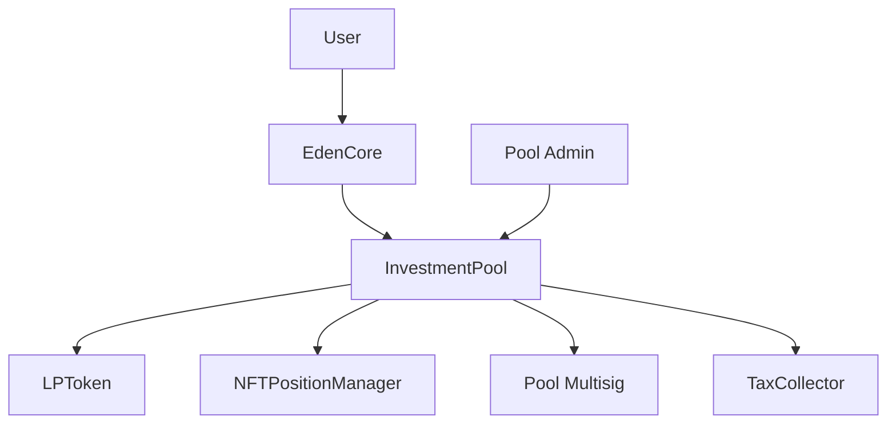

# InvestmentPool Contract

The **InvestmentPool** contract manages individual investment pools with specific terms, lock periods, and guaranteed returns. Each pool operates independently with its own configuration, multisig governance, and LP token system.

<Note>
**Implementation Address (Testnet):** `0x6e19C6fe7ACA463B616a991003a628a6cb5f1c89`
</Note>

## Overview

Investment pools are the core building blocks of EdenVest, where users can:
- **Deposit cNGN** for fixed-term investments
- **Earn guaranteed returns** based on predetermined APY
- **Receive LP tokens** representing pool shares
- **Get NFT positions** for investment tracking
- **Withdraw at maturity** with principal + returns

## Pool Architecture



## Key Features

### 🎯 **Fixed-Term Investments**
- Lock periods from 7 days to 2 years
- Guaranteed APY rates
- Simple interest calculations
- Automatic maturity tracking

### 💰 **LP Token Economics**
- ERC20 tokens representing pool shares
- Proportional minting based on pool state
- Burn on withdrawal
- Tax collection integration

### 🔒 **Multi-Signature Security**
- Pool funds managed by multisig wallet
- Admin functions require proper authorization
- Emergency pause capabilities
- Configurable governance parameters

## Pool Configuration

### PoolConfig Structure

```solidity
struct PoolConfig {
    string name;                // Pool display name
    uint256 lockDuration;       // Lock period in seconds (7 days - 2 years)
    uint256 minInvestment;      // Minimum investment amount
    uint256 maxInvestment;      // Maximum investment amount
    uint256 utilizationCap;     // Total pool capacity (0 = unlimited)
    uint256 expectedRate;       // APY in basis points (1500 = 15%)
    uint256 taxRate;            // Pool-specific tax rate (0 = use global)
    bool acceptingDeposits;     // Whether pool accepts new deposits
}
```

### Configuration Examples

<CodeGroup>
```typescript Conservative Pool
const poolConfig = {
  name: "Conservative 30-Day Pool",
  lockDuration: 30 * 24 * 60 * 60, // 30 days
  minInvestment: ethers.utils.parseEther("100"), // 100 cNGN
  maxInvestment: ethers.utils.parseEther("5000"), // 5,000 cNGN
  utilizationCap: ethers.utils.parseEther("50000"), // 50k total capacity
  expectedRate: 800, // 8% APY
  taxRate: 200, // 2% tax rate
  acceptingDeposits: true
};
```

```typescript High-Yield Pool
const poolConfig = {
  name: "High Yield 1-Year Pool",  
  lockDuration: 365 * 24 * 60 * 60, // 1 year
  minInvestment: ethers.utils.parseEther("1000"), // 1,000 cNGN
  maxInvestment: ethers.utils.parseEther("25000"), // 25k cNGN
  utilizationCap: ethers.utils.parseEther("500000"), // 500k total capacity
  expectedRate: 1800, // 18% APY
  taxRate: 300, // 3% tax rate
  acceptingDeposits: true
};
```
</CodeGroup>

## Core Functions

### Investment Functions

#### `invest()`
Process investment deposits (called by EdenCore).

```solidity
function invest(
    address investor, 
    uint256 amount, 
    string memory title
) external 
  returns (uint256 tokenId, uint256 userLPTokens, uint256 taxAmount)
```

**Process Flow:**
1. Validate investment amount and pool state
2. Calculate LP tokens and tax amount
3. Create investment record
4. Mint LP tokens to investor and tax collector
5. Mint NFT position to investor
6. Transfer funds to pool multisig

**Returns:**
- `tokenId`: NFT position token ID
- `userLPTokens`: LP tokens minted to investor  
- `taxAmount`: LP tokens minted for tax collection

#### `withdraw()`
Process investment withdrawals (called by EdenCore).

```solidity
function withdraw(
    address investor,
    uint256 tokenId, 
    uint256 lpAmount
) external returns (uint256 withdrawAmount)
```

**Validation Requirements:**
- Investment must be matured (`block.timestamp >= maturityTime`)
- Investor must own the NFT position
- Sufficient LP tokens must be provided
- Investment must not already be withdrawn

### Administrative Functions

#### `updatePoolConfig()`
Update pool configuration parameters.

```solidity
function updatePoolConfig(PoolConfig memory config) 
    external onlyRole(POOL_ADMIN_ROLE)
```

**Validation Rules:**
- Lock duration: 7 days ≤ duration ≤ 2 years
- Min investment must be > 0
- Max investment must be ≥ min investment
- Expected rate must be ≤ 100% APY (10000 basis points)

#### `setAcceptingDeposits()`
Toggle deposit acceptance.

```solidity
function setAcceptingDeposits(bool accepting) 
    external onlyRole(POOL_ADMIN_ROLE)
```

#### `updatePoolMultisig()`
Change pool multisig wallet address.

```solidity
function updatePoolMultisig(address newMultisig) 
    external onlyRole(POOL_ADMIN_ROLE)
```

### View Functions

#### `getPoolConfig()`
Retrieve current pool configuration.

```solidity
function getPoolConfig() external view returns (PoolConfig memory)
```

#### `getInvestment()`
Get investment details by ID.

```solidity
function getInvestment(uint256 investmentId) 
    external view returns (Investment memory)
```

**Investment Structure:**
```solidity
struct Investment {
    address investor;        // Investor address
    uint256 amount;         // Investment amount (cNGN)
    string title;           // Custom investment title
    uint256 depositTime;    // Deposit timestamp
    uint256 maturityTime;   // Maturity timestamp
    uint256 expectedReturn; // Expected total return
    bool isWithdrawn;       // Withdrawal status
    uint256 lpTokens;       // LP tokens representing investment
}
```

#### `getPoolStats()`
Get comprehensive pool statistics.

```solidity
function getPoolStats() external view returns (
    uint256 deposited,     // Total deposited amount
    uint256 withdrawn,     // Total withdrawn amount  
    uint256 available,     // Available capacity
    uint256 utilization    // Utilization percentage (basis points)
)
```

#### `getUserInvestments()`
Get all investment IDs for a user.

```solidity
function getUserInvestments(address user) 
    external view returns (uint256[] memory)
```

#### `isWithdrawable()`
Check if an investment can be withdrawn.

```solidity
function isWithdrawable(uint256 tokenId) external view returns (bool)
```

## Return Calculations

### Expected Return Formula

```solidity
function _calculateExpectedReturn(uint256 amount) internal view returns (uint256) {
    uint256 timeInSeconds = poolConfig.lockDuration;
    return (amount * poolConfig.expectedRate * timeInSeconds) / (BASIS_POINTS * 365 days);
}
```

### LP Token Calculation

```solidity
function _calculateLPTokens(uint256 amount) internal view returns (uint256) {
    uint256 totalSupply = IERC20(lpToken).totalSupply();
    
    if (totalSupply == 0) {
        return amount; // 1:1 ratio for first deposit
    } else {
        return (amount * totalSupply) / totalDeposited;
    }
}
```

### Tax Calculation

```solidity
uint256 effectiveTaxRate = poolConfig.taxRate > 0 
    ? poolConfig.taxRate 
    : edenCore.globalTaxRate();
    
uint256 taxAmount = (totalLPTokens * effectiveTaxRate) / BASIS_POINTS;
uint256 userLPTokens = totalLPTokens - taxAmount;
```

## Integration Examples

### Pool Interaction

```javascript
import { ethers } from 'ethers';
import InvestmentPoolABI from './abis/InvestmentPool.json';

class PoolManager {
  constructor(poolAddress, provider) {
    this.contract = new ethers.Contract(
      poolAddress,
      InvestmentPoolABI,
      provider
    );
  }

  async getPoolInfo() {
    const [config, stats] = await Promise.all([
      this.contract.getPoolConfig(),
      this.contract.getPoolStats()
    ]);

    return {
      name: config.name,
      lockDuration: config.lockDuration.toNumber(),
      expectedRate: config.expectedRate.toNumber() / 100, // Convert to percentage
      minInvestment: ethers.utils.formatEther(config.minInvestment),
      maxInvestment: ethers.utils.formatEther(config.maxInvestment),
      totalDeposited: ethers.utils.formatEther(stats.deposited),
      utilization: stats.utilization.toNumber() / 100, // Convert to percentage
      availableCapacity: ethers.utils.formatEther(stats.available)
    };
  }

  async getUserPositions(userAddress) {
    const investmentIds = await this.contract.getUserInvestments(userAddress);
    
    const positions = await Promise.all(
      investmentIds.map(async (id) => {
        const investment = await this.contract.getInvestment(id);
        return {
          id: id.toNumber(),
          amount: ethers.utils.formatEther(investment.amount),
          title: investment.title,
          depositTime: new Date(investment.depositTime.toNumber() * 1000),
          maturityTime: new Date(investment.maturityTime.toNumber() * 1000),
          expectedReturn: ethers.utils.formatEther(investment.expectedReturn),
          isMatured: investment.maturityTime.toNumber() <= Date.now() / 1000,
          isWithdrawn: investment.isWithdrawn
        };
      })
    );

    return positions;
  }

  calculateReturns(amount, lockDurationDays) {
    const config = await this.contract.getPoolConfig();
    const amountWei = ethers.utils.parseEther(amount.toString());
    const timeInSeconds = lockDurationDays * 24 * 60 * 60;
    
    const expectedReturn = amountWei
      .mul(config.expectedRate)
      .mul(timeInSeconds)
      .div(10000)
      .div(365 * 24 * 60 * 60);

    return {
      principal: amount,
      interest: parseFloat(ethers.utils.formatEther(expectedReturn)),
      total: amount + parseFloat(ethers.utils.formatEther(expectedReturn))
    };
  }
}
```

### Pool Monitoring Dashboard

```typescript
interface PoolMetrics {
  address: string;
  name: string;
  tvl: number;
  apy: number;
  utilization: number;
  activeInvestments: number;
  avgInvestmentSize: number;
  timeToNextMaturity: number;
}

class PoolMonitor {
  async getPoolMetrics(poolAddresses: string[]): Promise<PoolMetrics[]> {
    return await Promise.all(
      poolAddresses.map(async (address) => {
        const pool = new PoolManager(address, this.provider);
        const info = await pool.getPoolInfo();
        
        return {
          address,
          name: info.name,
          tvl: parseFloat(info.totalDeposited),
          apy: info.expectedRate,
          utilization: info.utilization,
          activeInvestments: await this.getActiveInvestmentCount(address),
          avgInvestmentSize: await this.getAverageInvestmentSize(address),
          timeToNextMaturity: await this.getNextMaturityTime(address)
        };
      })
    );
  }

  async getActiveInvestmentCount(poolAddress: string): Promise<number> {
    // Implementation to count active investments
    const events = await this.contract.queryFilter(
      this.contract.filters.InvestmentCreated(),
      0,
      'latest'
    );
    
    const withdrawnEvents = await this.contract.queryFilter(
      this.contract.filters.InvestmentWithdrawn(),
      0, 
      'latest'
    );

    return events.length - withdrawnEvents.length;
  }
}
```

## Security Features

### Access Control

| Role | Permissions | Functions |
|------|-------------|-----------|
| `DEFAULT_ADMIN_ROLE` | Pool administration | All admin functions |
| `POOL_ADMIN_ROLE` | Pool management | Update config, pause/unpause |
| `MULTISIG_ROLE` | Pool governance | Multisig operations |

### Input Validation

```solidity
// Investment validation
require(poolConfig.acceptingDeposits, "Deposits paused");
require(amount >= poolConfig.minInvestment, "Below minimum");
require(amount <= poolConfig.maxInvestment, "Exceeds maximum");

if (poolConfig.utilizationCap > 0) {
    require(totalDeposited + amount <= poolConfig.utilizationCap, "Exceeds cap");
}

// Withdrawal validation  
require(investment.investor == investor, "Not owner");
require(!investment.isWithdrawn, "Already withdrawn");
require(block.timestamp >= investment.maturityTime, "Not matured");
require(IERC721(nftManager).ownerOf(tokenId) == investor, "NFT not owned");
```

### Emergency Controls

- **Pause Mechanism**: Stop new investments during emergencies
- **Multisig Protection**: Critical functions require multisig approval
- **Admin Override**: Emergency withdrawal capabilities
- **Upgrade Safety**: Proper storage layout maintenance

## Events

### Investment Events

```solidity
event InvestmentCreated(
    uint256 indexed investmentId,
    address indexed investor,
    uint256 amount,
    uint256 lpTokens,
    uint256 indexed tokenId,
    uint256 expectedReturn,
    uint256 maturityTime,
    string title
);

event InvestmentWithdrawn(
    uint256 indexed investmentId,
    address indexed investor,
    uint256 withdrawAmount
);
```

### Administrative Events

```solidity
event PoolConfigUpdated(PoolConfig config);
event PoolMultisigUpdated(address newMultisig);
event DepositsToggled(bool accepting, address admin);
```

## Best Practices

### For Pool Administrators

1. **Regular Monitoring**: Track pool utilization and performance
2. **Multisig Management**: Ensure sufficient multisig wallet balance
3. **Configuration Updates**: Adjust parameters based on market conditions
4. **Emergency Preparedness**: Have pause/unpause procedures ready

### For Developers

1. **Error Handling**: Always check transaction success and revert reasons
2. **Event Monitoring**: Subscribe to relevant events for real-time updates
3. **Gas Optimization**: Batch multiple operations when possible
4. **Testing**: Comprehensive test coverage for all scenarios

### For Users

1. **Due Diligence**: Review pool configuration and multisig setup
2. **Diversification**: Spread investments across multiple pools
3. **Maturity Planning**: Track investment maturity dates
4. **NFT Security**: Secure your position NFTs in safe wallets

---

<CardGroup cols={2}>
  <Card
    title="LP Token System"
    icon="coins"
    href="/contracts/lp-token"
  >
    Understand the LP token mechanics and economics
  </Card>
  <Card
    title="NFT Positions"
    icon="image"
    href="/contracts/nft-position-manager"
  >
    Learn about investment position NFTs and rendering
  </Card>
  <Card
    title="Pool Factory"
    icon="industry"
    href="/contracts/pool-factory"
  >
    Discover how pools are created and deployed
  </Card>
  <Card
    title="Investment Guide"
    icon="rocket"
    href="/guides/investing"
  >
    Step-by-step guide to making investments
  </Card>
</CardGroup>