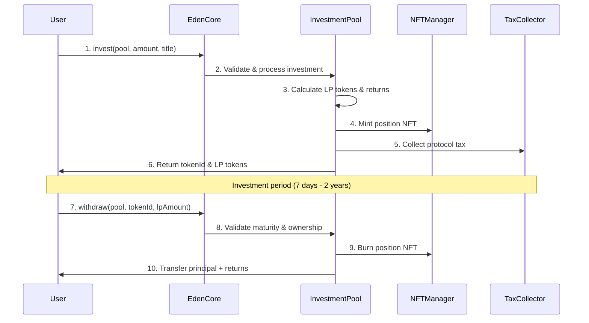
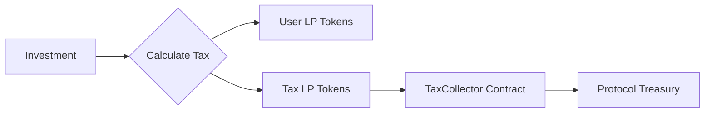

# How EdenVest Works

EdenVest revolutionizes DeFi investing by providing **fixed-term investment pools** with guaranteed returns. Unlike traditional yield farming, EdenVest offers predictable outcomes through a sophisticated smart contract ecosystem.

## Investment Lifecycle



## Core Components

### 1. Investment Pools

Each investment pool is an isolated smart contract with specific parameters:

<CardGroup cols={2}>
  <Card title="Pool Configuration" icon="settings">
    - **Lock Duration**: 7 days to 2 years
    - **APY Rate**: Fixed percentage returns
    - **Min/Max Investment**: Deposit limits
    - **Utilization Cap**: Total pool capacity
  </Card>
  <Card title="Pool Management" icon="users-gear">
    - **Multisig Control**: Multi-signature governance
    - **Admin Functions**: Pool configuration updates
    - **Emergency Controls**: Pause/unpause capabilities
    - **Tax Collection**: Protocol fee handling
  </Card>
</CardGroup>

### 2. LP Token Economics

When you invest, you receive **LP (Liquidity Provider) tokens** representing your share:

```typescript
// First investment in empty pool
lpTokens = investmentAmount  // 1:1 ratio

// Subsequent investments  
lpTokens = (investmentAmount × totalSupply) ÷ totalDeposited
```

**Example:**
- You invest **1,000 cNGN** in an empty pool → Get **1,000 LP tokens**
- Pool now has 1,000 cNGN total, 1,000 LP tokens total
- Next investor deposits **500 cNGN** → Gets **500 LP tokens**
- Pool now has 1,500 cNGN total, 1,500 LP tokens total

### 3. NFT Position Tracking

Every investment is represented by a unique **non-transferable NFT** that displays:

<AccordionGroup>
  <Accordion title="Visual Information">
    - Investment amount and expected returns
    - Time remaining until maturity  
    - Pool name and APY rate
    - Dynamic progress bars
    - Status indicators (Active/Mature/Withdrawn)
  </Accordion>
  
  <Accordion title="Technical Metadata">
    - Token ID and investment ID mapping
    - Deposit and maturity timestamps
    - LP token amounts
    - Pool contract address
  </Accordion>
  
  <Accordion title="Animated Features">
    - Floating animations with CSS transforms
    - Color-changing progress bars
    - Pulsing effects for active investments
    - Nigerian-inspired design elements
  </Accordion>
</AccordionGroup>

## Return Calculation

EdenVest uses a **simple interest formula** for predictable returns:

```solidity
expectedReturn = (principal × APY × lockDuration) ÷ (10000 × 365 days)
```

### Examples

<CodeGroup>
```typescript 30-Day Investment
const principal = 1000; // 1000 cNGN
const apy = 1200; // 12% APY (1200 basis points)
const lockDuration = 30 * 24 * 60 * 60; // 30 days in seconds

const expectedReturn = (principal * apy * lockDuration) / (10000 * 365 * 24 * 60 * 60);
// expectedReturn = 9.86 cNGN
// Total at maturity = 1009.86 cNGN
```

```typescript 1-Year Investment  
const principal = 5000; // 5000 cNGN
const apy = 1500; // 15% APY (1500 basis points)
const lockDuration = 365 * 24 * 60 * 60; // 1 year in seconds

const expectedReturn = (principal * apy * lockDuration) / (10000 * 365 * 24 * 60 * 60);
// expectedReturn = 750 cNGN  
// Total at maturity = 5750 cNGN
```
</CodeGroup>

## Token Swap Integration

EdenVest integrates **Assetchain Swap** for seamless token swapping:

### Swap Process

1. **Quote Generation**: Get expected cNGN output amount
2. **Slippage Protection**: Automatic slippage calculation (max 3%)
3. **Token Transfer**: Move input tokens to SwapRouter
4. **Swap Execution**: Execute trade via Assetchain Swap
5. **Investment Processing**: Use output cNGN for investment

### Supported Features

<CardGroup cols={2}>
  <Card title="Security Features" icon="shield-check">
    - Rate limiting for quote requests
    - Maximum slippage protection
    - Failed swap tracking and limits
    - Emergency pause capabilities
  </Card>
  <Card title="Pool Fee Management" icon="percentage">
    - Custom fees per token pair
    - Default 0.3% fee tier
    - Support for 0.05%, 0.3%, and 1% tiers
    - Admin-configurable fee structures
  </Card>
</CardGroup>

## Tax Collection System

The protocol collects a **configurable tax** (default 2.5%) on all investments:

### Tax Mechanism



### Tax Configuration

- **Global Tax Rate**: Protocol-wide default (2.5%)
- **Pool-Specific Tax**: Pools can override global rate
- **LP Token Tax**: Tax collected as LP tokens, not cNGN
- **Treasury Distribution**: Periodic withdrawal to protocol treasury

## Governance & Security

### Multisig Governance

Critical operations require **multiple signatures** (minimum 2 of N):

<Tabs>
  <Tab title="Protocol Operations">
    - Pause/unpause protocol
    - Update global tax rates  
    - Change protocol treasury
    - Emergency fund recovery
    - Add/remove multisig signers
  </Tab>
  
  <Tab title="Pool Operations">
    - Update pool configurations
    - Manage pool multisig wallets
    - Control deposit acceptance
    - Emergency pool actions
  </Tab>
</Tabs>

### Proposal System

```typescript
interface Proposal {
  id: number;
  proposalType: ProposalType;
  proposer: address;
  createdAt: timestamp;
  expiresAt: timestamp; // 2-day expiry
  executed: boolean;
  signatureCount: number;
  data: bytes; // Encoded function call
  description: string;
}
```

**Proposal Lifecycle:**
1. **Creation**: Multisig signer creates proposal
2. **Signing**: Other signers review and sign
3. **Auto-execution**: Executes when threshold reached (2+ signatures)
4. **Expiry**: Proposals expire after 2 days
