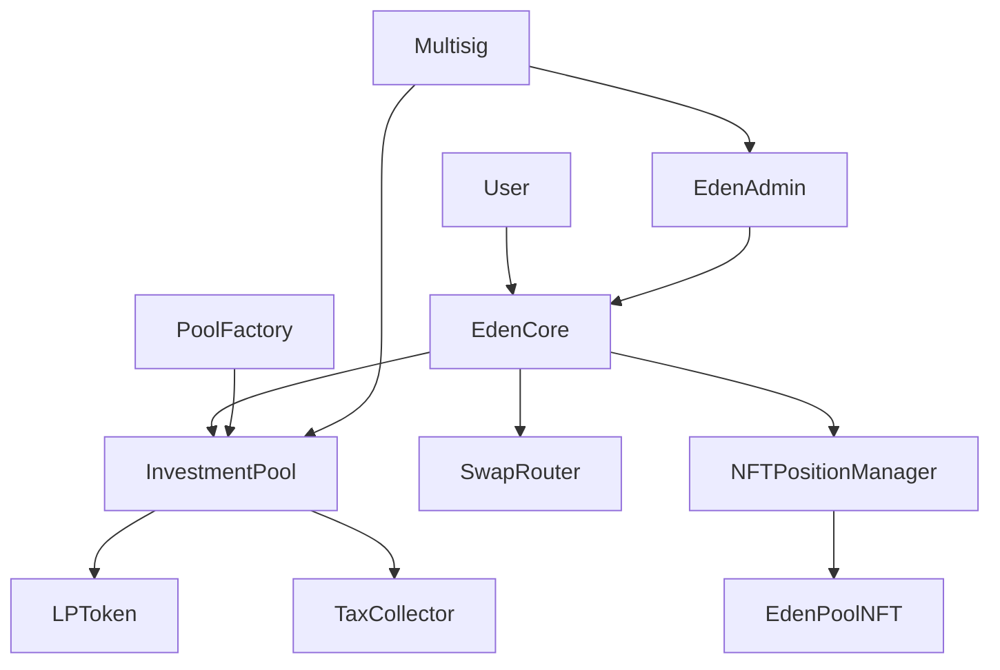

# Welcome to EdenVest

**EdenVest** is a revolutionary DeFi investment protocol designed specifically for the Nigerian market, enabling fixed-term cNGN investments with guaranteed returns through a secure, transparent smart contract ecosystem.

## What is EdenVest?

EdenVest transforms traditional investment models by offering **fixed-term investment pools** where users can:

- **Invest cNGN** with predetermined lock periods and guaranteed APY
- **Receive NFT positions** with beautiful, animated SVG representations
- **Earn predictable returns** ranging from 7 days to 2 years
- **Access transparent governance** through multisig-controlled protocols

<CardGroup cols={2}>
  <Card
    title="High Yields"
    icon="chart-line"
    href="/guides/investing"
  >
    Earn competitive APY rates with guaranteed returns on cNGN investments
  </Card>
  <Card
    title="NFT Positions"
    icon="image"
    href="/guides/nft-positions"
  >
    Beautiful, non-transferable NFTs representing your investment positions
  </Card>
  <Card
    title="Multisig Security"
    icon="shield-halved"
    href="/protocol/security"
  >
    Multi-signature governance ensuring maximum protocol security
  </Card>
  <Card
    title="Nigerian Focus"
    icon="naira-sign"
    href="/protocol/tokenomics"
  >
    Built specifically for the Nigerian market using cNGN stablecoin
  </Card>
</CardGroup>

## Key Features

### 🎯 **Fixed-Term Investments**
Lock your cNGN for predetermined periods (7 days to 2 years) and receive guaranteed returns at maturity.

### 🎨 **NFT Position Tracking**
Each investment is represented by a unique, animated NFT that displays:
- Investment amount and expected returns
- Time remaining until maturity
- Pool information and APY
- Dynamic progress bars and status indicators

### 🔐 **Multisig Governance**
Critical protocol operations require multiple signatures:
- Pause/unpause protocol
- Update tax rates and treasury
- Emergency fund recovery
- Add/remove governance participants

### 💱 **Integrated Token Swaps**
Seamlessly swap other tokens to cNGN using our integrated Uniswap V3 router with:
- Slippage protection
- Rate limiting for security
- Comprehensive failure handling

## Architecture Overview

The protocol consists of interconnected smart contracts that manage:

- **Investment lifecycle** from deposit to withdrawal
- **Pool creation and management** with customizable parameters  
- **Tax collection and distribution** to protocol treasury
- **NFT minting and rendering** for position tracking
- **Governance and emergency controls** via multisig

## Contract Addresses

### Assetchain Mainnet

| Contract | Address |
|----------|---------|
| **EdenCore Proxy** | `0xA5f9e65B17ed0B34263285a5bE9059E45Fd61597` |
| **EdenAdmin** | `0xa4EbDFC4949Ba52E837Fca3b6a2fAb98c7492b5C` |
| **TaxCollector** | `0x5104b1E5fDBa07a4DE396b70Ff19Da5a58b6A2d1` |
| **SwapRouter** | `0x0A46C99cA1e64aB05A943907FC6361476899Dd1c` |
| **PoolFactory** | `0xd8D7338FB2f854c1F40F55Ef28dC2134FA3141f1` |
| **NFTPositionManager** | `0xD200b9D79570beb26F105eBe6ce5D5FE6a9BDC83` |

### Assetchain Enugu Testnet

| Contract | Address |
|----------|---------|
| **EdenCore Proxy** | `0xC2EdCE6C2282B367A1269Ff77FB95855067cdaaf` |
| **EdenAdmin** | `0xE15e1aED46cE2D8A319E4885CE52177D0696722D` |
| **TaxCollector** | `0x3BAb3110A2C4D986320F83Ac86Bab1229B3e7e4C` |
| **SwapRouter** | `0x87A09E8048E06765A21742399018d684f2E690b3` |
| **PoolFactory** | `0x4f703B2A060859a38DEFc9c34C8Ab02df160b15E` |
| **NFTPositionManager** | `0x1824De8E500F92E5C08de4a152e74224548Daa83` |

## Quick Start

<AccordionGroup>
  <Accordion title="1. Connect Your Wallet">
    Connect your Web3 wallet (MetaMask, Brave, OKX) to Assetchain testnet
  </Accordion>
  
  <Accordion title="2. Get Test Tokens(For testnet)">
    Obtain cNGN test tokens from our faucet or swap other tokens using our integrated router
  </Accordion>
  
  <Accordion title="3. Choose an Investment Pool">
    Browse available pools with different lock periods, APYs, and minimum investments
  </Accordion>
  
  <Accordion title="4. Make Your Investment">
    Invest your cNGN and receive an NFT representing your position and LP tokens.
  </Accordion>
  
  <Accordion title="5. Track Your Position">
    Monitor your investment through your NFT with real-time progress updates
  </Accordion>
  
  <Accordion title="6. Withdraw at Maturity">
    Claim your principal plus guaranteed returns when your investment matures
  </Accordion>
</AccordionGroup>

## Next Steps

<CardGroup cols={2}>
  <Card
    title="How It Works"
    icon="gear"
    href="/how-it-works"
  >
    Learn about the investment lifecycle and protocol mechanics
  </Card>
  <Card
    title="Start Investing"
    icon="rocket"
    href="/guides/investing"
  >
    Follow our step-by-step guide to make your first investment
  </Card>
  <Card
    title="Smart Contracts"
    icon="code"
    href="/contracts/overview"
  >
    Explore the technical implementation and contract architecture
  </Card>
  <Card
    title="Integration Guide"
    icon="plug"
    href="/api/overview"
  >
    Build applications on top of the EdenVest protocol
  </Card>
</CardGroup>

---

<Snippet file="support-footer.mdx" />